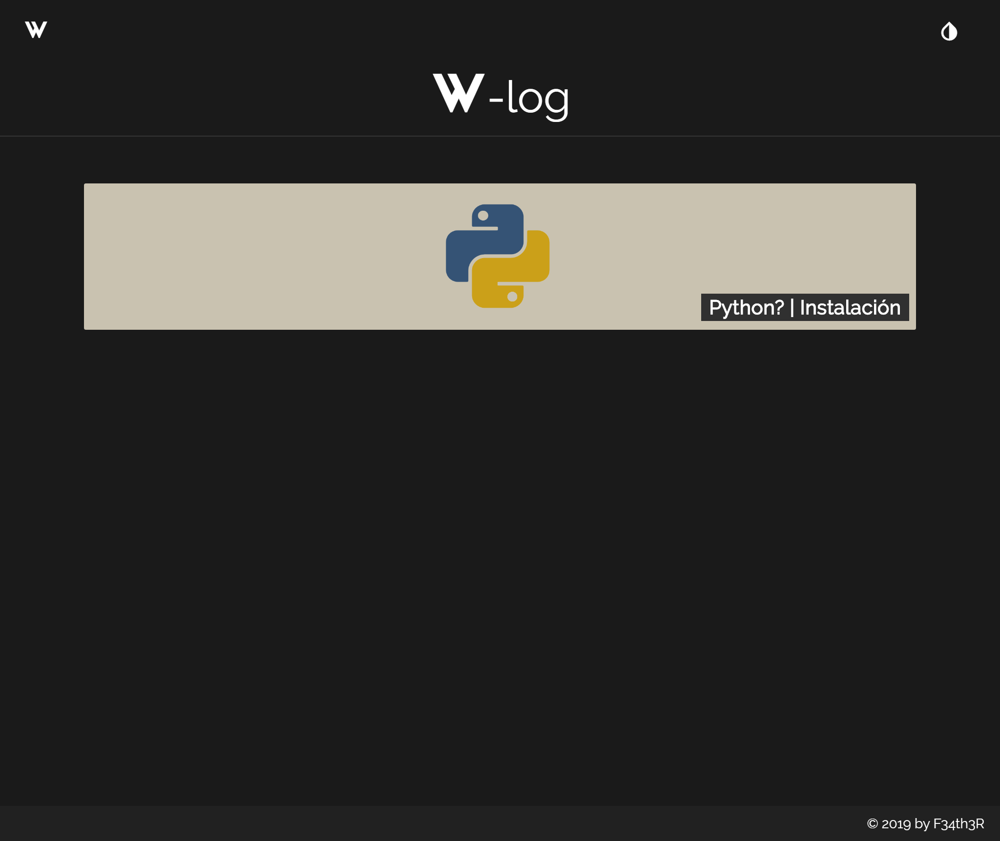
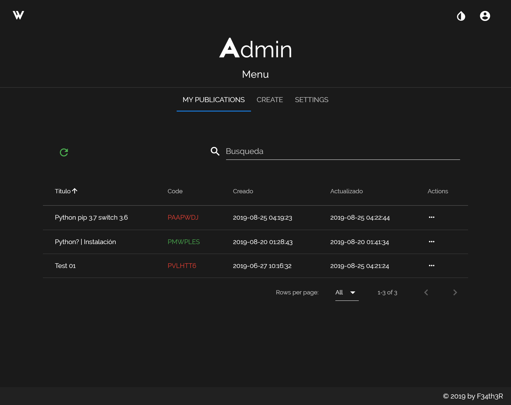
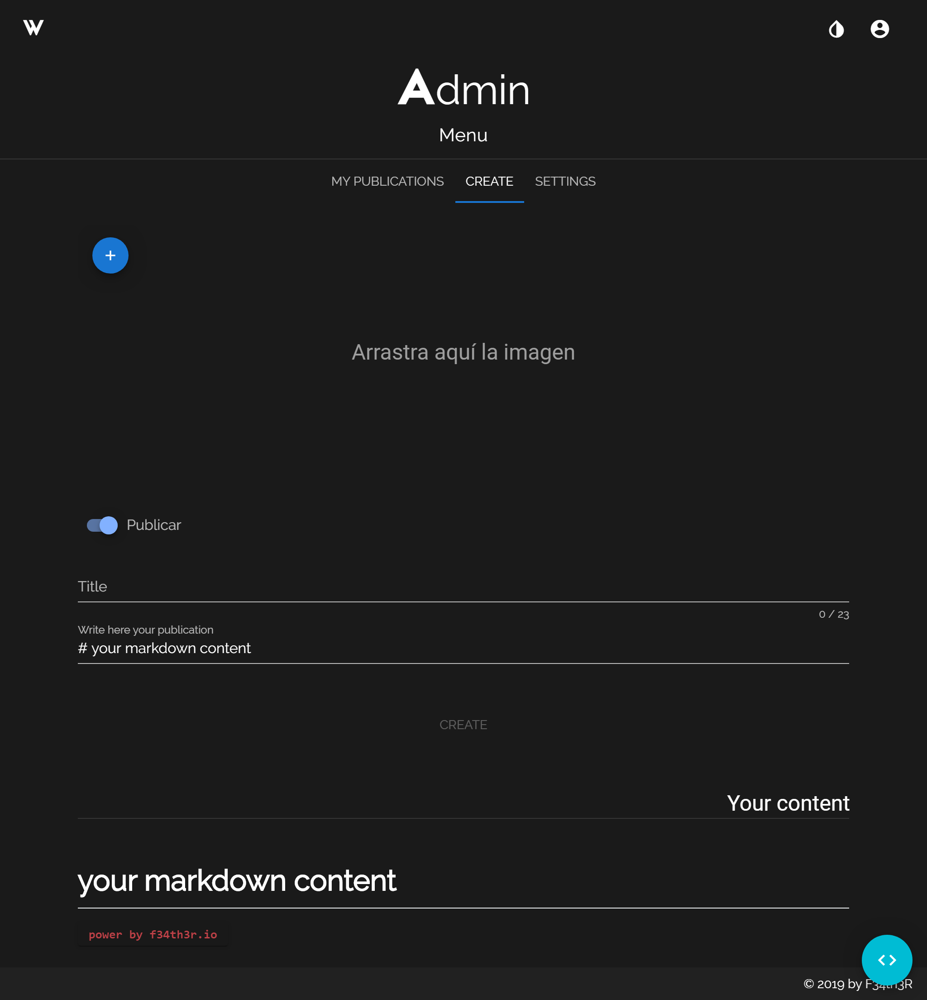

# W-Blog | F34th3r blog

## Description
At one point, it was my blog. It is the client model of a simple blog. Which, the posts are written in markdown. Using VueJs as a framework.

## Project setup
```
npm install
```

### Compiles and hot-reloads for development
```
npm run serve
```

### Compiles and minifies for production
```
npm run build
```

### Run your tests
```
npm run test
```

### Lints and fixes files
```
npm run lint
```

## Screenshots








